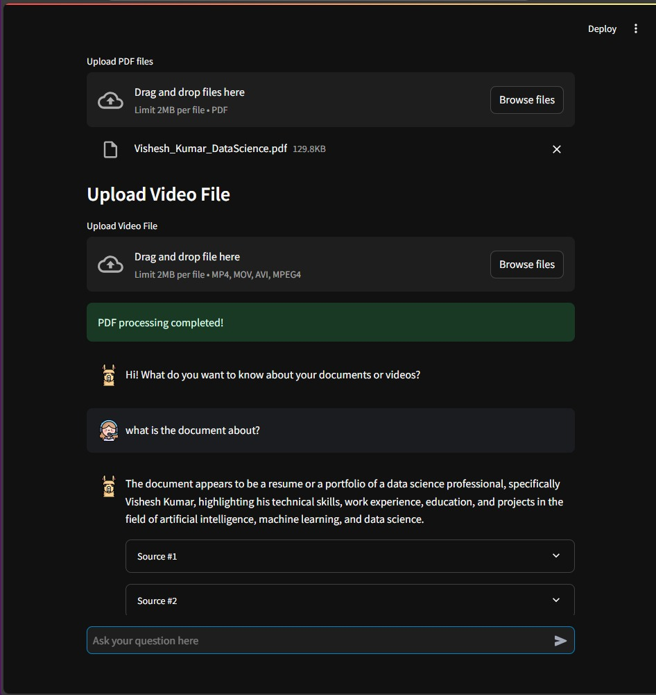
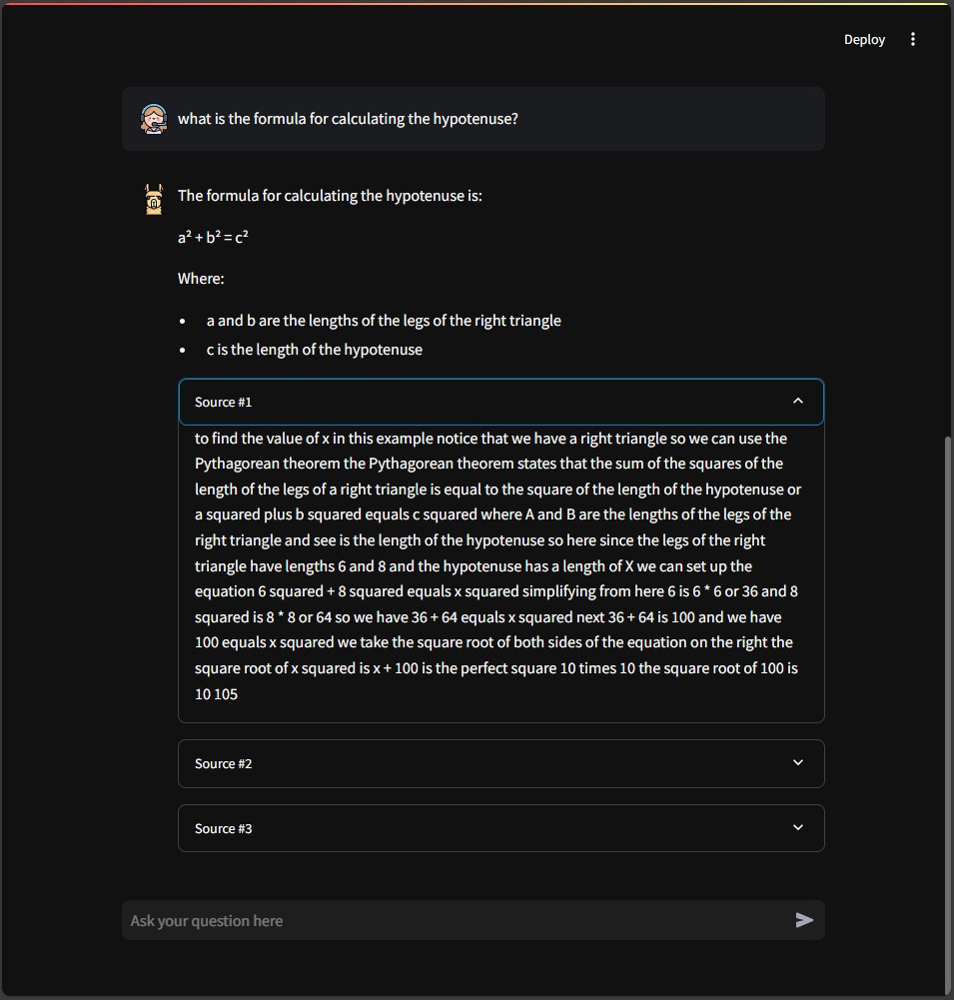
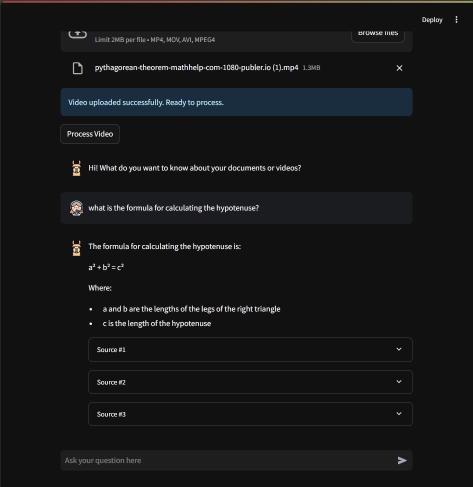

## Refined Rag - Private Document Chat


Refined Rag allows you to privately query and interact with your own documents in natural language. Run everything locally, ensure data privacy, and gain valuable insights from your files—no cloud dependency required.

---

## Features at a Glance
- **Local LLM Integration**: Use local large language models (LLMs) like `gemma2:9b` via [Ollama](https://ollama.com/) or connect to [Groq API](https://groq.com/) for flexible inference.
- **Private Document Conversation**: Ask questions about your documents, get summarized answers, and never send your private data to third-party services.
- **Fast & Secure Vector Retrieval**: Efficiently index and search documents with Qdrant and rerank with FlashRank for accurate, context-rich responses.
- **Seamless UI**: Interact through a user-friendly [Streamlit](https://streamlit.io/) interface—just point and chat.

---

## Quick Start

### 1. **Clone the Repository**
```bash
git clone git@github.com:vishes711/RefinedRAG_BDS.git
cd RefinedRAG_BDS
```

### 2. **Install Dependencies**

#### Using [Poetry](https://python-poetry.org/):
```bash
python -m poetry install
```

#### Using `pip` and `requirements.txt`:
If you prefer using `pip`, install dependencies directly:
```bash
pip install -r requirements.txt
```

### 3. **(Optional) Download a Local LLM**
Pull the default local LLM:
```bash
ollama pull gemma2:9b
ollama serve
```

### 4. **(Optional) Set Up Groq API**
To switch from the local LLM to Groq API, add a `.env` file:
```env
GROQ_API_KEY=YOUR_API_KEY
```

### 5. **Run the App**
```bash
python -m streamlit run app.py
```

---

## Requirements

### `requirements.txt`
Below is the list of dependencies included in the `requirements.txt` file:

```plaintext
streamlit==1.36.0
speechrecognition==3.8.1
python-dotenv==1.0.1
langchain==0.2.6
langchain-community==0.2.6
langchain-experimental==0.0.62
langchain-qdrant==0.1.1
langchain-groq==0.1.6
qdrant-client==1.10.1
pypdfium2==4.30.0
fastembed==0.3.3
flashrank==0.2.8
```

Install all dependencies using:
```bash
pip install -r requirements.txt
```

---

## Technical Overview

### **Ingestor**
- Extracts text from PDFs using PDFium.
- Splits documents into chunks using semantic and character-based methods.
- Stores embeddings in Qdrant, a vector database.



### **Retriever**
- Given a query, locates and re-ranks relevant chunks.
- Applies LLM-based filtering for better accuracy.



### **QA Chain**
- Orchestrates between the retriever and the LLM.
- Provides context-driven, summarized answers to user queries.



---

## Technology Stack

- **Ollama**: Local LLM inference.
- **Groq API**: High-performance inference service for multiple LLMs.
- **LangChain**: Chain together various LLM operations easily.
- **Qdrant**: Lightning-fast vector database for semantic search.
- **FlashRank**: Efficient re-ranking of search results.
- **FastEmbed**: Lightweight embedding generator.
- **Streamlit**: A modern UI layer for a rich, interactive user experience.
- **PDFium**: High-quality PDF processing and text extraction.

---

Refined Rag is more than a tool—it's your private knowledge assistant that helps you unlock insights from your documents safely and efficiently. Get started now and experience a new way of interacting with your data!
